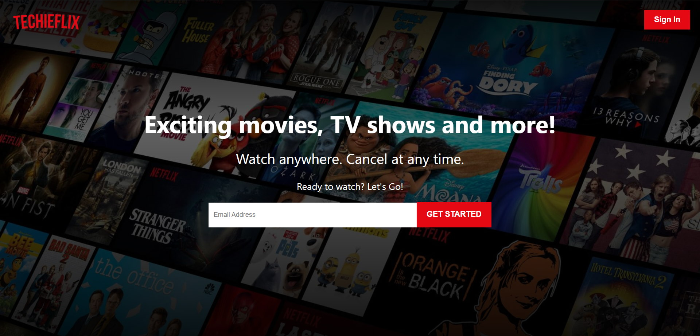
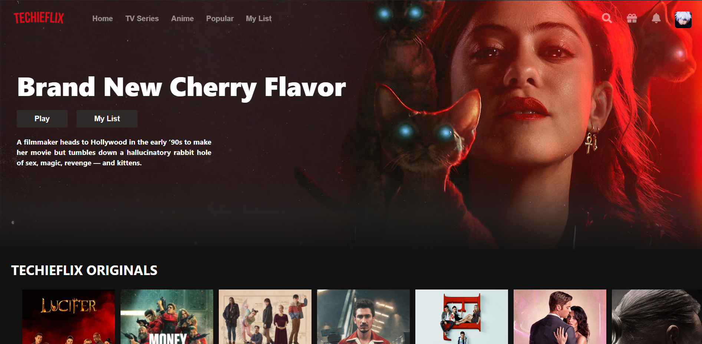
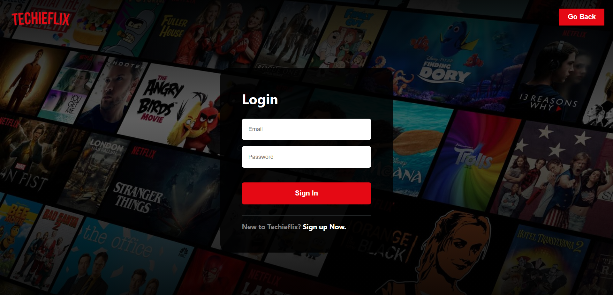
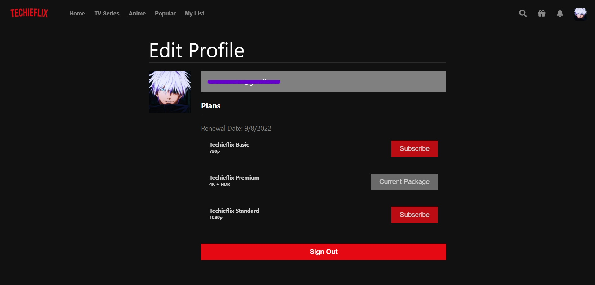

<h1 align="center">
  Techieflix
</h1>

  
  
  
  
  

> A Netflix clone created by **McTechie** 👨‍🎨✨

### Concepts Covered

- [x] APIs
- [x] Redux Toolkit
- [x] Firebase (Auth & Firestore)
- [x] React Lazy Loading
- [x] ESLint / Pre-commit Setup

---

### Landing Screen

---

### Home Screen

---

### Login Screen

---

### Profile Screen

